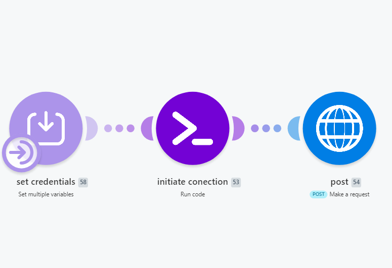

# make-post-to-x-oauth
A Make.com template that posts to X using your own X API credentials and custom OAuth 1.0a signing, no native Make X module required.

# Post to X (Twitter) from Make.com without the native X module

Make's built-in X module requires their Twitter app integration. 
This template skips it entirely. Bring your own X API credentials 
(free tier works) and post tweets via raw HTTP with OAuth 1.0a signing.

## What you need
- Make.com account (free tier works)
- X Developer account with an app (free tier works for posting)
- 4 credentials from your X app:
  - Consumer Key (API Key)
  - Consumer Secret (API Key Secret)
  - Access Token
  - Access Token Secret

## Setup (5 min)
1. [Download workflow.json](make-post-to-x-oauth.blueprint.json)
2. In Make.com: Create scenario → ••• → Import Blueprint → select the file
3. Open Module 58 (Set Variables), paste your 4 X credentials
4. Open Module 54 (HTTP), edit the body text to whatever you want to post
5. Run

## How it works
- Module 58: Stores your X API credentials as scenario variables
- Module 53: Custom JavaScript that builds the OAuth 1.0a HMAC-SHA1 signature X requires
- Module 54: HTTP POST to https://api.x.com/2/tweets with the auth header

## Use cases
- Chain this after any scenario that generates content (RSS, GPT, scraping, Notion)
- Replace the hardcoded body with `{{your_variable}}` to post dynamic content
- Free X API tier supports ~17 posts per day

## Screenshot

## Built by Ozan Atmar
I build Make automations for founders.  
Site: https://ozan.atmar.bg  
Email: ozanatmar@atmar.bg
